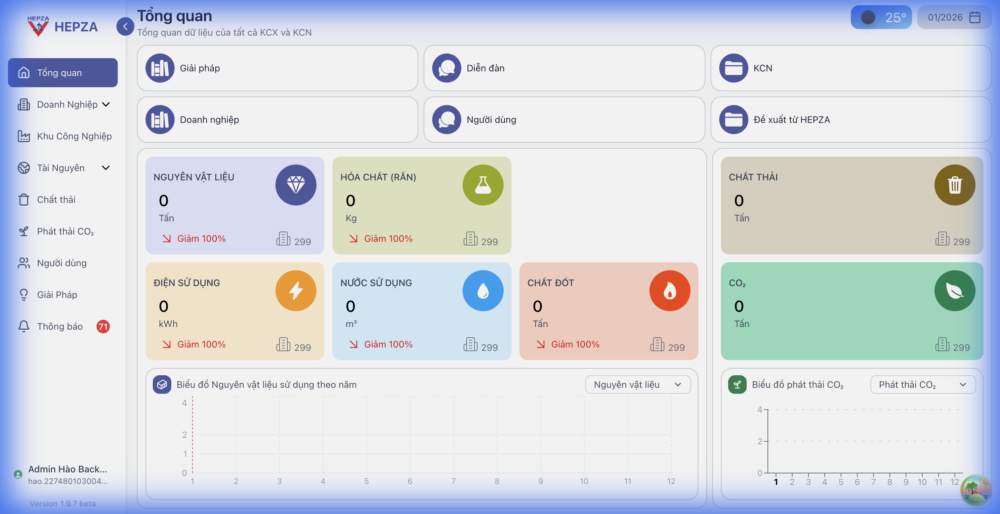
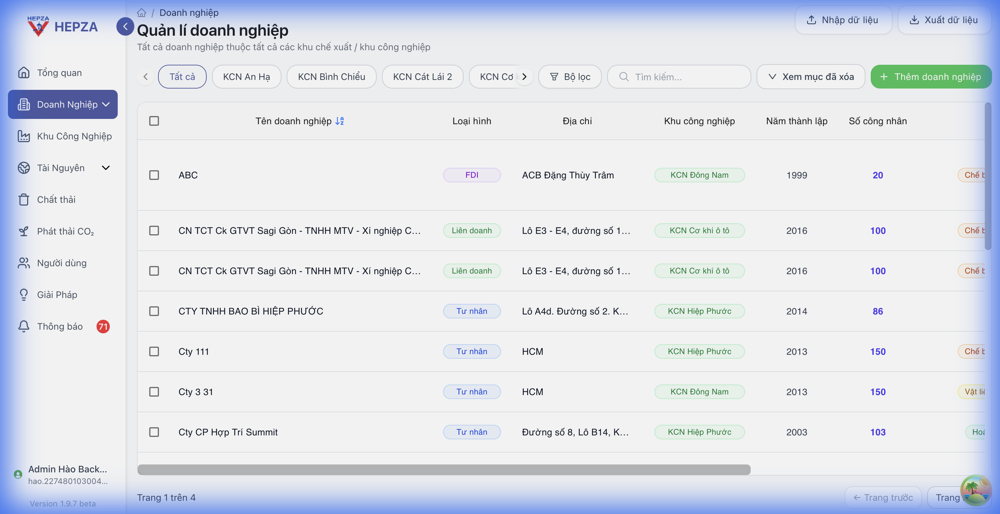
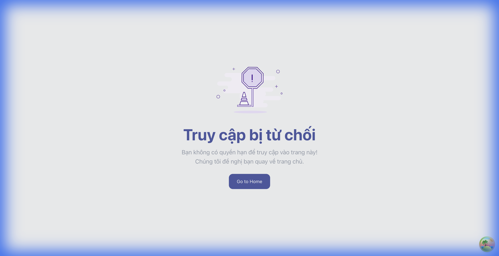
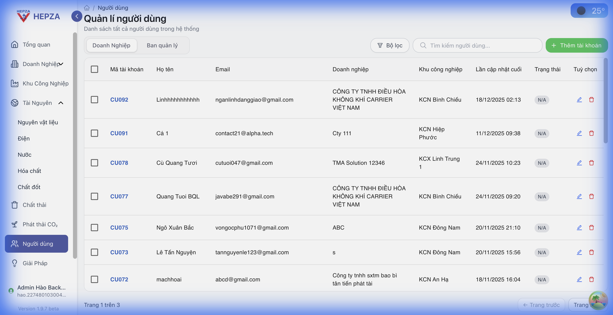
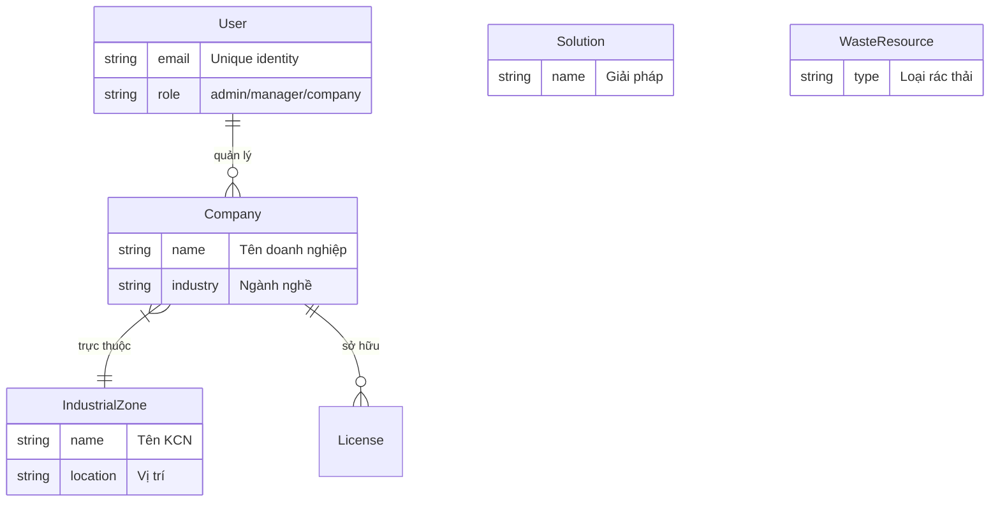

<div align="center">

# 🌿 HEPZA PROJECT
### Nền Tảng Quản Lý & Cộng Sinh Công Nghiệp Tương Lai



[](https://reactjs.org/)
[](https://vitejs.dev/)
[](https://tailwindcss.com/)
[](https://nodejs.org/)
[](https://expressjs.com/)
[](https://www.mongodb.com/)
[](https://redis.io/)

---

<p align="center">
  <b>Số hóa quản lý - Tối ưu tài nguyên - Kết nối cộng sinh</b><br/>
  Giải pháp toàn diện cho các Khu Chế Xuất & Khu Công Nghiệp TP.HCM (HEPZA)
</p>

</div>

## ✨ Tính Năng Đột Phá

| Tính Năng | Mô Tả |
| :--- | :--- |
| **📊 Dashboard Thông Minh** | Tổng quan trực quan về tiêu thụ điện, nước, và phát thải theo thời gian thực. |
| **🏭 Quản Lý Doanh Nghiệp** | Hồ sơ số hóa chi tiết, theo dõi giấy phép và hoạt động sản xuất. |
| **♻️ Cộng Sinh Công Nghiệp** | "Tinder cho Phế liệu" - Kết nối cung cầu tái chế, thúc đẩy kinh tế tuần hoàn. |
| **👥 Phân Quyền Đa Cấp** | Hệ thống Role-based (Admin, Manager, Company) bảo mật và linh hoạt. |
| **🔔 Thông Báo Real-time** | Cập nhật tức thì qua Socket.io & Redis Pub/Sub. |

---

## 📸 Giao Diện Người Dùng

### 1. Quản Trị Hệ Thống


### 2. Hồ Sơ Doanh Nghiệp


### 3. Sàn Giao Dịch Cộng Sinh


### 4. Quản Lý Người Dùng


---

## 🛠 Công Nghệ Sử Dụng

### Client Side 🎨
- **Core**: React 18, Vite
- **UI/UX**: Tailwind CSS v4, Ant Design, Material UI
- **State**: React Query (TanStack), Context API
- **Maps**: React Leaflet
- **Charts**: Recharts

### Server Side ⚙️
- **Runtime**: Node.js
- **Framework**: Express.js
- **Database**: MongoDB (Mongoose ODM)
- **High Performance**: Redis (Caching & Queue), BullMQ
- **Real-time**: Socket.io

---

## 📐 Kiến Trúc Hệ Thống

### Sơ đồ ERD (Tóm tắt)


---

## 🚀 Cài Đặt & Triển Khai

### Yêu cầu tiên quyết
*   Node.js v18+
*   MongoDB & Redis running

### 1. Khởi chạy Backend
```bash
cd ServerSide
npm install
# Tạo file .env dựa trên .env.example
npm start
# Hoặc chế độ dev
npm run dev
```

### 2. Khởi chạy Frontend
```bash
cd ClientSide
npm install
npm run dev
```

Truy cập hệ thống tại: `http://localhost:5173`

---

## 🔌 API Cheatsheet

| Method | Endpoint | Mô tả |
| :--- | :--- | :--- |
| `POST` | `/api/auth/login` | Đăng nhập hệ thống |
| `GET` | `/api/companies` | Lấy danh sách doanh nghiệp |
| `POST` | `/api/business-symbiosis/buy-demand` | Đăng nhu cầu mua phế liệu |
| `GET` | `/api/report` | Xuất báo cáo tổng hợp |

---

<div align="center">

**Developed with ❤️ by Hepza Team**
<br/>
Last update: 03/03/2026

</div>


